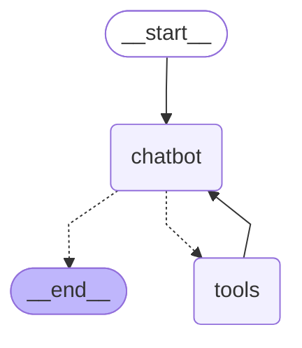

```mermaid
---
config:
  flowchart:
    curve: linear
---
graph TD;
	__start__([<p>__start__</p>]):::first
	chatbot(chatbot)
	tools(tools)
	__end__([<p>__end__</p>]):::last
	__start__ --> chatbot;
	chatbot -.-> __end__;
	chatbot -.-> tools;
	tools --> chatbot;
	classDef default fill:#f2f0ff,line-height:1.2
	classDef first fill-opacity:0
	classDef last fill:#bfb6fc

```
